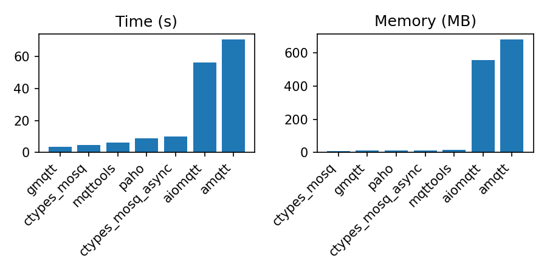
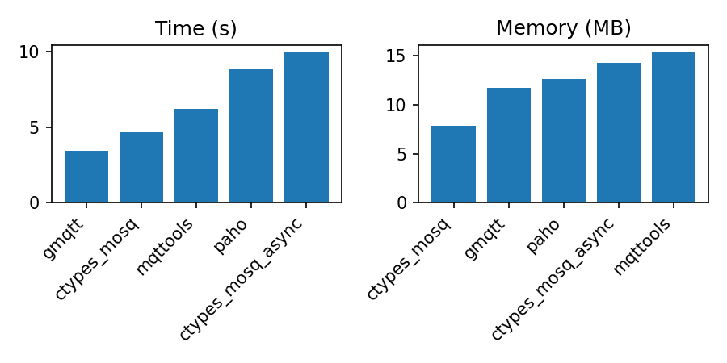

# ctypes-mosquitto

A lightweight Python MQTT client implemented as a binding to libmosquitto via ctypes.


## Dependencies

- python3.8+
- libmosquitto1


## Installation

- pip install ctypes-mosquitto


## Usage

```python
from ctypes_mosquitto import Mosquitto


def on_message(client, userdata, msg):
    print(msg)


client = Mosquitto()
client.on_connect = lambda *_: client.subscribe("#", 1)
client.on_message = on_message
client.connect_async("localhost", 1883)
client.loop_forever()
```

Async client example:

```python
import asyncio

from ctypes_mosquitto.aio import AIO
from ctypes_mosquitto import Mosquitto


async def main():
    async with AIO(Mosquitto()) as client:
        await client.connect("localhost", 1883)
        await client.subscribe("#", 1)
        async for msg in client.read_messages():
            print(msg)


asyncio.run(main())
```

Check out more examples in `tests` directory.


## Benchmarks

Receiving one million messages with QoS 0.

*The memory plots exclude the Python interpreter overhead (~10.3 MB).



Losers excluded:



**benchmark.csv**

```text
Module;Time;RSS
ctypes_mosq;4.64;8064
ctypes_mosq_async;9.91;14660
paho;8.80;12960
gmqtt;3.45;12044
mqttools;6.22;15704
aiomqtt;55.93;567444
amqtt;70.37;694336
```


## License

MIT
