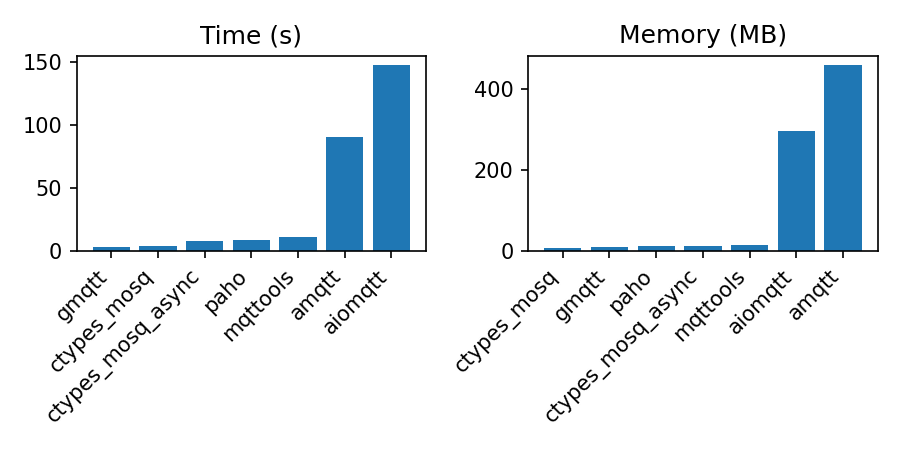
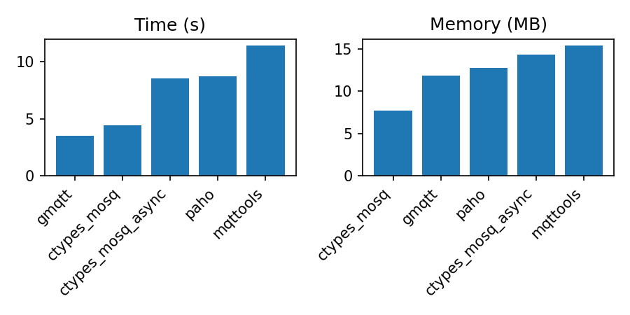

# ctypes-mosquitto

A lightweight Python MQTT client implemented as a thin wrapper around libmosquitto.


## Dependencies

- python3.8+
- libmosquitto1


## Installation

- pip install ctypes-mosquitto


## Usage

```python
from ctypes_mosquitto import Mosquitto


def on_message(client, userdata, msg):
    print(msg)


client = Mosquitto()
client.connect_callback_set(lambda *_: client.subscribe("#", qos=1))
client.message_callback_set(on_message)
client.connect_async("localhost", 1883)
client.loop_forever()
```

Async client example:

```python
import asyncio

from ctypes_mosquitto.aio import AIO
from ctypes_mosquitto import Mosquitto


async def main():
    async with AIO(Mosquitto()) as client:
        await client.connect("localhost", 1883)
        await client.subscribe("#", 1)
        async for msg in client.read_messages():
            print(msg)


asyncio.run(main())
```

Check out more examples in `tests` directory.


## Benchmarks

Receiving one million messages with QoS 0.

*The memory plots exclude the Python interpreter overhead (~10 MB).



Losers excluded:



**benchmark.csv**

```text
Module;Time;RSS
ctypes_mosq;4.44;7900
ctypes_mosq_async;8.54;14672
paho;8.74;13004
gmqtt;3.54;12136
mqttools;11.39;15716
aiomqtt;147.40;302936
amqtt;90.32;469020
```


## License

MIT
